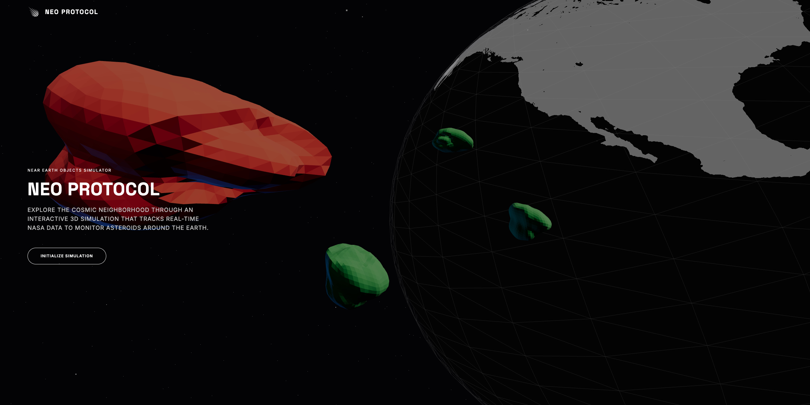

SUPSI 2026  
Corso d’interaction design, CV429.01  
Docenti: A. Gysin, G. Profeta  

Progetto 1: La conquista dello spazio

# NEO PROTOCOL
Autore: Melissa Broggini \
[NASA Neo-Sentinel](https://github.com/melissabroggini/Media-Interactions)

## Introduzione e tema
Neo-Sentinel è un'ecosistema web interattivo d'avanguardia progettato per monitorare in tempo reale i Near-Earth Objects (NEO). Sviluppato per celebrare il 70° anniversario della NASA, il progetto trasforma flussi di dati astrometrici complessi del Jet Propulsion Laboratory (JPL) in un'interfaccia di sorveglianza spaziale.

L'ispirazione estetica fonde l'intelligenza artificiale **JARVIS** di Iron Man con la pragmaticità visiva degli **HUD (Heads-Up Display)** dei jet militari e dei sistemi di puntamento avionici. L'utente non è un semplice spettatore, ma viene investito del ruolo di **Operatore di Monitoraggio**, agendo all'interno di un "Centro di Controllo" digitale dove la precisione scientifica incontra la narrazione sci-fi.

## Riferimenti progettuali
Il linguaggio visivo è una sintesi tra i rigorosi **NASA Graphics Standards** e l'immaginario cinematografico dei centri di comando aerospaziali (come quelli visti in *The Martian* o *Interstellar*).
- **Tipografia:** L'uso combinato di **Space Grotesk** (per i titoli e l'identità del protocollo) e **Inter** (per i dati tecnici e la leggibilità) garantisce un equilibrio tra estetica futuristica e rigore scientifico.
- **Palette Cromatica:** Basata sul contrasto estremo tipico del vuoto cosmico (`#131313` come superficie di fondo). Il sistema utilizza il **Data Green** (`#10E560`) per gli asteroidi sicuri e l'**Alert Red** (`#FF2A2A`) per gli asteroidi potenzialmente pericolosi, creando un codice visivo immediato per la valutazione del rischio.

## Design dell’interfaccia e modalità di interazione
L'applicazione si struttura come una console interattiva di live tracking:

- **Simulazione 3D Orbitale:** Sviluppata in Three.js, la scena centrale visualizza la Terra, la Luna e uno sciame dinamico di asteroidi. La Terra non è una semplice mesh statica, ma utilizza Shader personalizzati per visualizzare i continenti tramite mappe speculari e wireframe orbitali.
- **Radar Tattico (3D-to-2D Canvas):** Un radar vettoriale disegnato in tempo reale su Canvas 2D proietta la posizione degli asteroidi su un piano polare ellittico. Utilizza la proiezione isometrica per mostrare l'elevazione (stalk) dei corpi celesti rispetto al piano dell'eclittica terrestre, replicando la logica dei radar militari.
- **Analisi Velocità (Istogramma Dinamico):** Un modulo statistico processa i dati di velocità in KM/S degli asteroidi in transito, distribuendoli in 7 intervalli (bin) rappresentati da un istogramma interattivo. Questo permette all'utente di identificare istantaneamente anomalie di velocità nella popolazione di NEO monitorata.
- **Time Manipulation Unit:** Un sistema di controllo temporale avanzato permette di accelerare la simulazione (1X, 10X, 100X) o di navigare attraverso i dati storici di un mese tramite uno slider temporale.
- **Target Locking:** Cliccando su un asteroide (o tramite i controlli Prev/Next), il sistema esegue uno zoom cinematografico tramite TWEEN.js,"agganciando" la telecamera all'oggetto e rivelando un pannello dettagliato con: diametro stimato, velocità relativa, distanza minima dall'approccio e timestamp preciso. È inoltre presente il comando **"Get back to Earth"**, che permette all'operatore di resettare istantaneamente la visuale, riportando la Terra al centro dell'inquadratura. 

## Tecnologia usata
L'architettura del progetto si basa su tecnologie frontend native e librerie specializzate per la visualizzazione dati e 3D:

- **Core:** HTML5, CSS3 (Tailwind CSS per il design system e le utilità HUD).
- **Engine 3D:** **Three.js** con pipeline di post-processing (UnrealBloomPass per l'effetto bagliore dei marker e EffectComposer per il rendering multi-pass).
- **Logica e Matematica:** JavaScript ES6. Il sistema implementa calcoli di meccanica orbitale per simulare il movimento degli asteroidi (basato su velocità relativa e miss distance).
- **Data Management:** Fetch API per l'integrazione di dati reali tramite il **NASA NeoWs (Near Earth Object Web Service)**. Il sistema gestisce un file `snapshot.json` come fallback per garantire l'operatività anche offline o in caso di superamento dei limiti API.
- **Visual Feedback:** TWEEN.js per le transizioni fluide della telecamera e manipolazione diretta del DOM per gli aggiornamenti in tempo reale dei parametri HUD.

## Target e contesto d’uso
Neo-Sentinel è progettato per un'ampia gamma di scenari:
- **Istruzione e Divulgazione:** Scuole e musei scientifici possono utilizzarlo per spiegare la dinamica dei NEO in modo visivo e coinvolgente.
- **Appassionati di Spazio:** Fornisce uno strumento di monitoraggio "professionale" per chi desidera esplorare i dati NASA oltre le semplici tabelle numeriche.
- **Installazioni Desktop:** Ottimizzato per la fruizione su grandi schermi, dove la densità di informazioni dell'interfaccia HUD restituisce l'esperienza completa di un display da sala operativa.
- **Esperienza Museale:** Grazie alla sua natura interattiva e al feedback visivo immediato (cambio di stato in Allarme per gli oggetti pericolosi), si presta perfettamente per chioschi multimediali e mostre temporanee sullo spazio.
